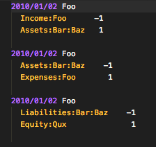
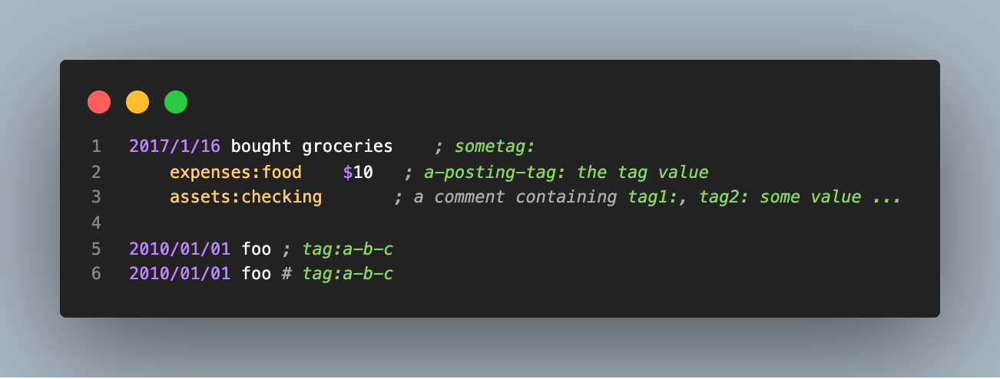

# hledger-vscode README

Language support for [HLedger](http://hledger.org/) command-line accounting [journal files](http://hledger.org/journal.html).

## Features

- Syntax highlighting

### Todo:

- Account Tab Completion

## Known Issues

- Currency list is a bit light
- No highlighting of currency amounts

## Updating Tests

We have golden file tests under `tests/cases`, containing example
`.in.hledger` files, and syntax-highlighted `.want` files. Run the tests with
`mocha -r ts-node/register tests/test.ts`.

If you've examined the differences and they're expected, rebuild the golden files by running
`ts-node tests/main.ts tests/cases/*.in.hledger`.
